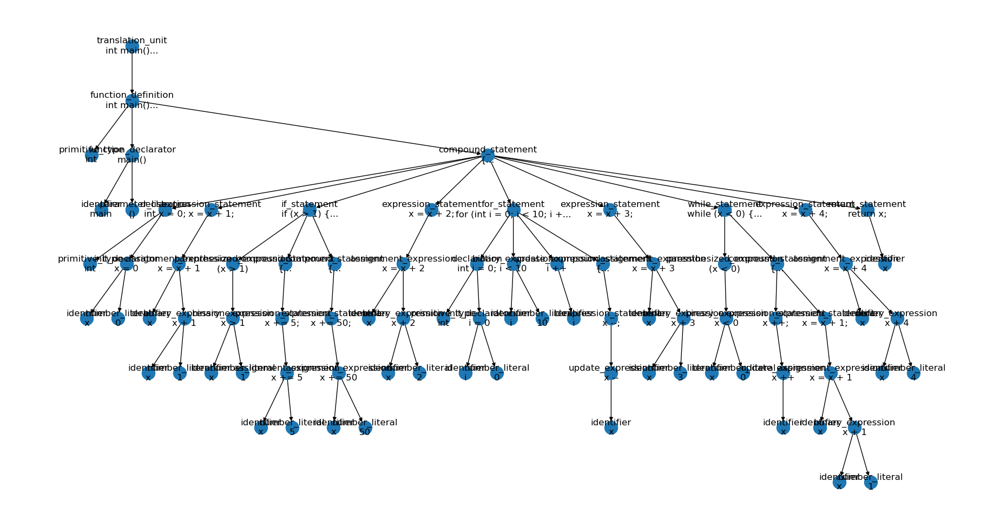
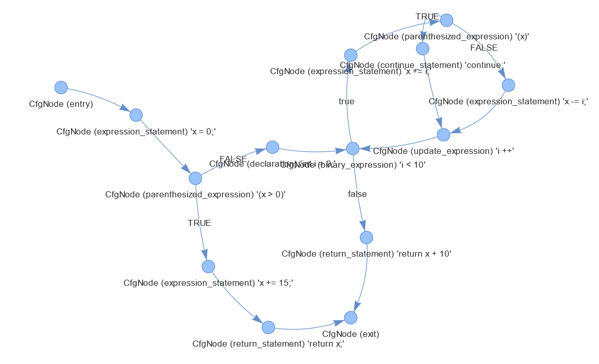
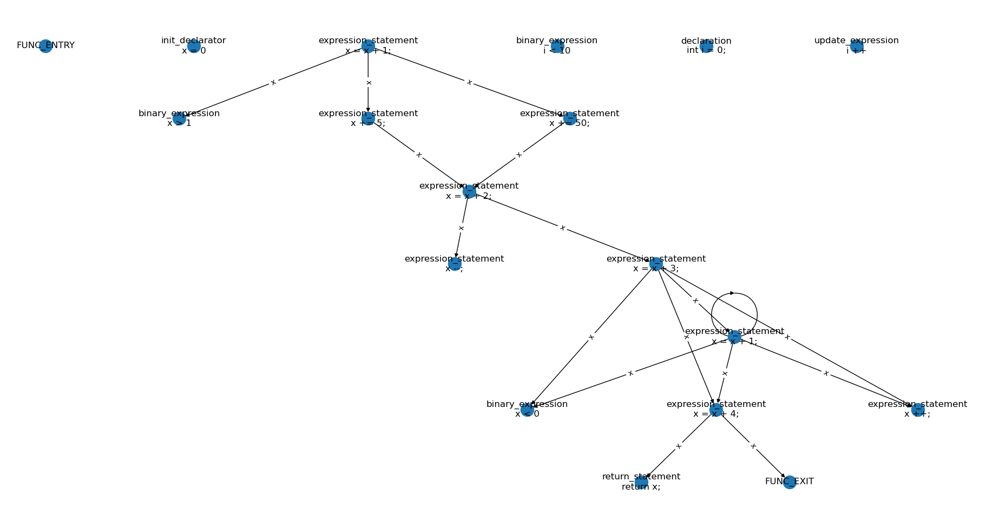
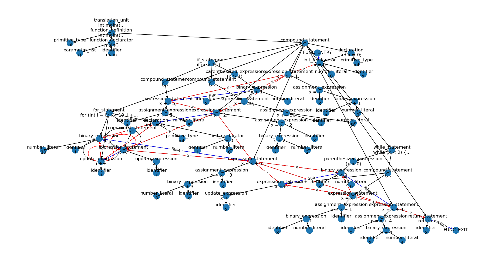

# tree-climber

Program analysis tools built on [tree-sitter](https://github.com/tree-sitter/tree-sitter).
Currently supports only C.

# Try it out

Install from pip:

```bash
pip install tree_climber
```

or run from source:

```bash
# install deps
pip install -r requirements.txt
# run on a test program :)
python tree_climber tests/data/example.c --draw_ast --draw_cfg --draw_duc
```

For Fedora 36:
```
sudo dnf install graphviz-devel python3-tkinter
```

Feel free to open a PR with other platform-specific instructions.

See [developers.md](./developers.md) for developer setup instructions.

# Table of contents

1. [Features](#features)
	1. [Visualize AST](#visualize-ast)
	2. [Construct and visualize Control-flow graph (CFG)](#construct-and-visualize-control-flow-graph-cfg)
	3. [Monotonic dataflow analysis](#monotonic-dataflow-analysis)
	4. [Construct and visualize Def-use chain (DUC)](#construct-and-visualize-def-use-chain-duc)
	5. [Construct and visualize Code Property Graph (CPG)](#construct-and-visualize-code-property-graph-cpg)
2. [Contribute](#contribute)

# Features

Examples shown on [tests/data/example.c](./tests/data/example.c).
```c
int main()
{
    int x = 0;
    x = x + 1;
    if (x > 1) {
        x += 5;
    }
    else {
        x += 50;
    }
    x = x + 2;
    for (int i = 0; i < 10; i ++) {
        x --;
    }
    x = x + 3;
    while (x < 0) {
        x ++;
        x = x + 1;
    }
    x = x + 4;
    return x;
}
```

## Visualize AST

Visualize AST without concrete tokens included in tree-sitter:
```bash
python main.py tests/data/example.c --draw_ast
```

Example:


## Construct and visualize Control-flow graph (CFG)

Convert tree-sitter AST to CFG for C programs.
AST -> CFG algorithm is based on Joern, specifically [CfgCreator.scala](https://github.com/joernio/joern/blob/6df0bbe6afad7f9b04bf0d1877e9797a7cdddcc4/joern-cli/frontends/x2cpg/src/main/scala/io/joern/x2cpg/passes/controlflow/cfgcreation/CfgCreator.scala).

Visualize CFG:
```bash
python main.py tests/data/example.c --draw_cfg
```

Example:


## Monotonic dataflow analysis

See `dataflow_solver.py`.

## Construct and visualize Def-use chain (DUC)

Visualize DUC:
```bash
python main.py tests/data/example.c --draw_duc
```

Example:


## Construct and visualize Code Property Graph (CPG)

CPG composes AST + CFG + DUC into one graph for combined analysis.
Eventual goal is feature parity with Joern's usage in ML4SE.

Visualize CPG (edges are color-coded - black = AST, blue = CFG, red = DUC):
```bash
python main.py tests/data/example.c --draw_cpg
```

Example:


# Contribute

[Open issues on Github](https://github.com/bstee615/tree-climber/issues)

# Stress test (Jun 16 2022, outdated)

File [parse.sh](./tests/vs-joern/parse.sh) runs Joern and tree-sitter side by side to compare performance.
Use [joern-install.sh](./tests/vs-joern/joern-install.sh) to install Joern first.

Benchmark 1: long stupid file - 10,000 lines of `x++`.
Output 2022-06-15 19:44, v1.1.891 of Joern:
```bash
(tree-sitter-py38) benjis@AM:~/code/ts$ bash tests/vs-joern/parse.sh --joern tests/data/10000.c
executing /home/benjis/code/ts/tests/vs-joern/get_func_graph.scala with params=Map(filename -> tests/data/10000.c)
Compiling /home/benjis/code/ts/tests/vs-joern/get_func_graph.scala
creating workspace directory: /home/benjis/code/ts/workspace
Creating project `10000.c` for code at `tests/data/10000.c`
moving cpg.bin.zip to cpg.bin because it is already a database file
Creating working copy of CPG to be safe
Loading base CPG from: /home/benjis/code/ts/workspace/10000.c/cpg.bin.tmp
Code successfully imported. You can now query it using `cpg`.
For an overview of all imported code, type `workspace`.
Adding default overlays to base CPG
The graph has been modified. You may want to use the `save` command to persist changes to disk.  All changes will also be saved collectively on exit
script finished successfully
Some(())

real    0m14.143s
user    0m44.302s
sys     0m1.260s
(tree-sitter-py38) benjis@AM:~/code/ts$ bash tests/vs-joern/parse.sh --tree-sitter tests/data/10000.c

real    0m1.503s
user    0m1.385s
sys     0m0.111s
```

Benchmark 2: [Linux kernel 5.18.4](https://cdn.kernel.org/pub/linux/kernel/v5.x/linux-5.18.4.tar.xz)
Output 2022-06-15 21:51, v1.1.891 of Joern:
```bash
(tree-sitter-py38) benjis@AM:~/code/ts$ time python main.py linux-5.18.4 --cfg --file > output_treesitter.txt

real    9m47.570s
user    9m4.308s
sys     0m5.854s

(base) benjis@AM:~/code/ts$ time ./joern/joern-cli/joern --script ./tests/vs-joern/get_func_graph.scala --params filename=linux-5.18.4
executing /home/benjis/code/ts/tests/vs-joern/get_func_graph.scala with params=Map(filename -> linux-5.18.4)
Compiling /home/benjis/code/ts/tests/vs-joern/get_func_graph.scala
creating workspace directory: /home/benjis/code/ts/workspace
Creating project `linux-5.18.4` for code at `linux-5.18.4`
Killed
Error running shell command: List(/home/benjis/code/ts/joern/joern-cli/c2cpg.sh, linux-5.18.4, --output, /home/benjis/code/ts/workspace/linux-5.18.4/cpg.bin.zip)
Exception in thread "main" java.lang.AssertionError: script errored: 
	at io.joern.console.ScriptExecution.runScript(BridgeBase.scala:253)
	at io.joern.console.ScriptExecution.runScript$(BridgeBase.scala:229)
	at io.joern.joerncli.console.AmmoniteBridge$.runScript(AmmoniteBridge.scala:5)
	at io.joern.console.BridgeBase.runAmmonite(BridgeBase.scala:164)
	at io.joern.console.BridgeBase.runAmmonite$(BridgeBase.scala:146)
	at io.joern.joerncli.console.AmmoniteBridge$.runAmmonite(AmmoniteBridge.scala:5)
	at io.joern.joerncli.console.AmmoniteBridge$.delayedEndpoint$io$joern$joerncli$console$AmmoniteBridge$1(AmmoniteBridge.scala:7)
	at io.joern.joerncli.console.AmmoniteBridge$delayedInit$body.apply(AmmoniteBridge.scala:5)
	at scala.Function0.apply$mcV$sp(Function0.scala:39)
	at scala.Function0.apply$mcV$sp$(Function0.scala:39)
	at scala.runtime.AbstractFunction0.apply$mcV$sp(AbstractFunction0.scala:17)
	at scala.App.$anonfun$main$1(App.scala:76)
	at scala.App.$anonfun$main$1$adapted(App.scala:76)
	at scala.collection.IterableOnceOps.foreach(IterableOnce.scala:563)
	at scala.collection.IterableOnceOps.foreach$(IterableOnce.scala:561)
	at scala.collection.AbstractIterable.foreach(Iterable.scala:926)
	at scala.App.main(App.scala:76)
	at scala.App.main$(App.scala:74)
	at io.joern.joerncli.console.AmmoniteBridge$.main(AmmoniteBridge.scala:5)
	at io.joern.joerncli.console.AmmoniteBridge.main(AmmoniteBridge.scala)
Caused by: io.joern.console.ConsoleException: Error creating project for input path: `linux-5.18.4`

real	499m56.583s
user	1193m14.686s
sys	7m26.020s
```
